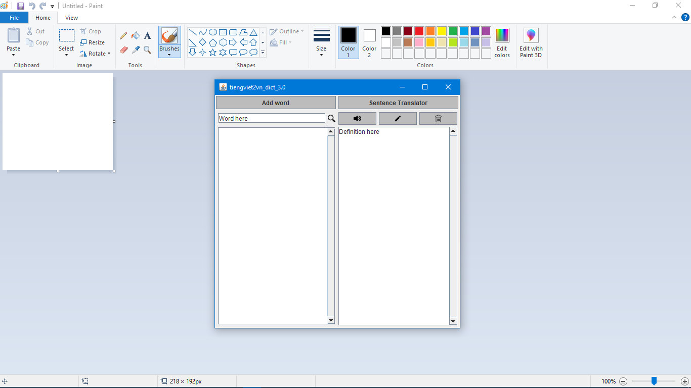
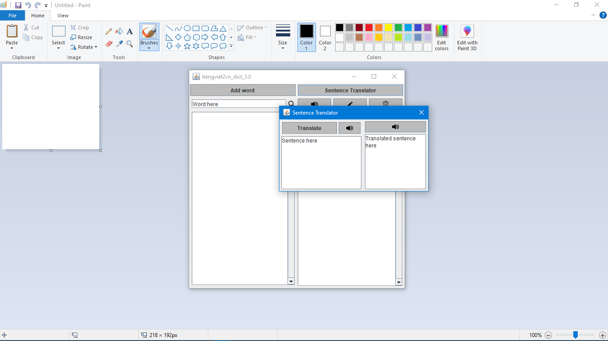
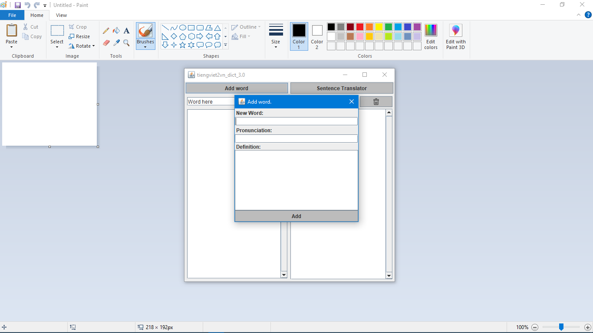

# tiengviet2vn_dict
## Table of contents 📘
- [tiengviet2vn_dict](#tiengviet2vn_dict)
	- [Description](#description-)
	- [Prerequisite](#prerequisite-)
	- [Data](#data-)
	- [How to compile and run](#how-to-compile-and-run-)
	- [Screenshot](#screenshot-)
	- [Side nodes](#side-notes-)
	- [Meta](#meta-)

## Description 📜
This is a small project made for *INT2204*.

## Prerequisite 💻
- We built this on Windows 10 so . . . it requires at least [Windows 7](https://en.wikipedia.org/wiki/Microsoft_Windows) I think.
- It could also work on other OS but you will have to figure out how to do that on your own.
- Below are requirements for Windows.

### tiengviet2vn_dict(\_0.0), tiengviet2vn_dict_1.0 and tiengviet2vn_dict_2.0
- First, install JDK8 (Java SE Development Kit 8) from [here](https://www.oracle.com/java/technologies/javase/javase-jdk8-downloads.html).
- After that, add your jdk bin folder's location to your [`Path`](https://www.google.com/search?q=how+to+add+path).
- Then, add another [Environment Variable](https://en.wikipedia.org/wiki/Environment_variable) named `JAVA_HOME` with you jdk folder's location as the value.

### tiengviet2vn_dict_3.0
- Same as above.
- An internet connection.
- tiengviet2vn_dict_3.0 also requires [Gradle](https://gradle.org) and a [Google application credentials](https://cloud.google.com/docs/authentication/getting-started) JSON file.
- After having Gradle and Google application credentials, add gradle bin folder's location to your Path and add a environment variable named `GOOGLE_APPLICATION_CREDENTIALS` with your JSON file's location as the value.
- If you don't have Google application credentials, you can contact me to get one by this email: 19020060@vnu.edu.vn

## Data 💾
- Data is also needed to run the application, sample data is already avaiable on this repo.
- You can replace the following data files in "*data*" folders:
	- `dictionaries.txt` with [this](https://drive.google.com/file/d/1U0cB3x8zRrbP3jeHmV1AwlKA1Mdtce-G/view?usp=sharing).
	- `AnhViet.dict` with [this](https://drive.google.com/file/d/1umbpnwR1KRRIA3i5Bgz5UcuKL1qSMl0o/view?usp=sharing).
- Or you can add your own data with the same format as those files.

## How to compile and run ⚙
- [Clone](https://docs.github.com/en/free-pro-team@latest/github/creating-cloning-and-archiving-repositories/cloning-a-repository) this repository or [download as zip](https://github.com/Darthveloper21/Big-Java-Boiz/archive/master.zip) and [extract](https://www.google.com/search?q=how+to+extract+zip).
- Fire up your [cmd](https://www.google.com/search?q=command+prompt) and [change working directory](https://www.google.com/search?q=change+working+directory+command+prompt) to the cloned folder.
- Change working directory to one of the three versions.
- If it's the 0.0, 1.0 or 2.0 version, change directory to "*src*" folder.
- Enter `compile` in cmd to compile the application.
- Enter `run` in cmd to run application.
- Or you can enter `compile & run` to do both 🙃.

## Screenshot 🖥

\*I used [mspaint](https://en.wikipedia.org/wiki/Microsoft_Paint) as the background.

## Side nodes 🗒
- The application may be laggy when using Google APIs related functions.

## Meta 📃
- Made by [***@Darthveloper21***](https://github.com/Darthveloper21) and [***@duongoku***](https://github.com/duongoku).
- This project is licensed under the [**MIT License**](https://choosealicense.com/licenses/mit).
